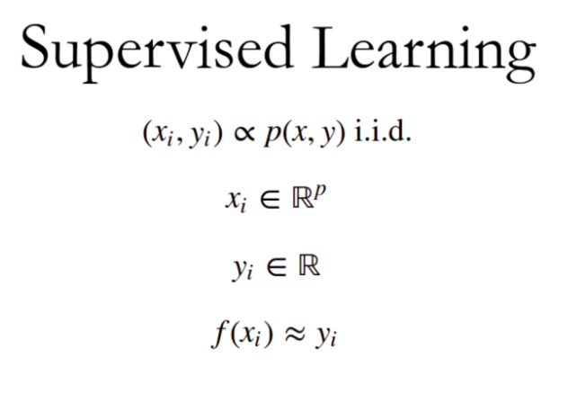
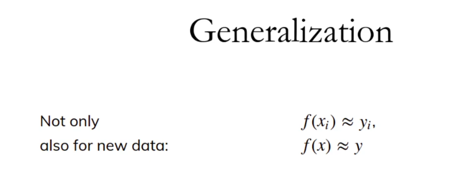
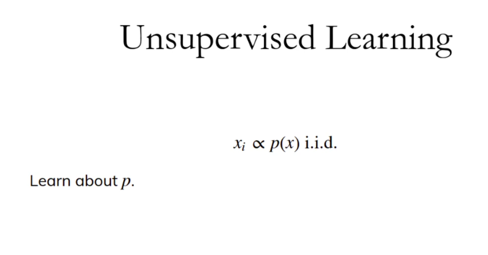
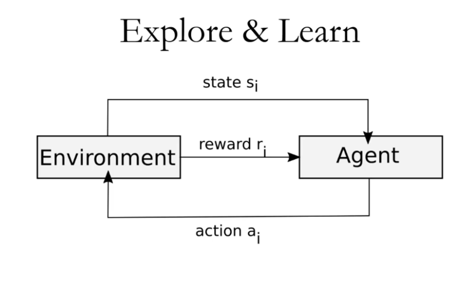
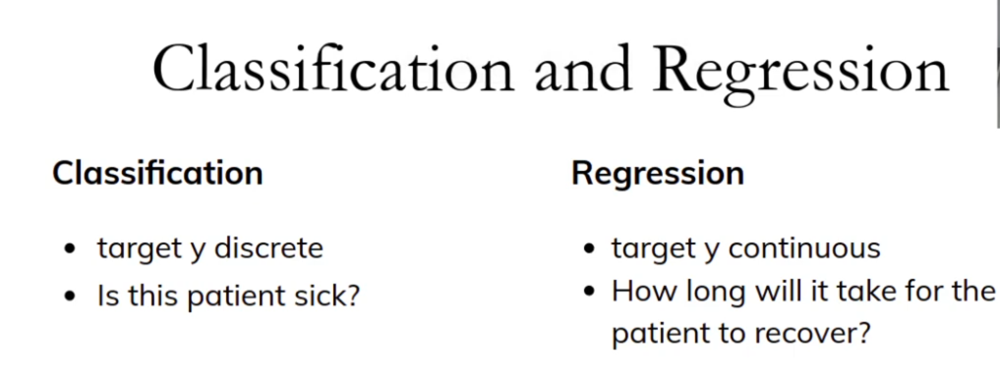
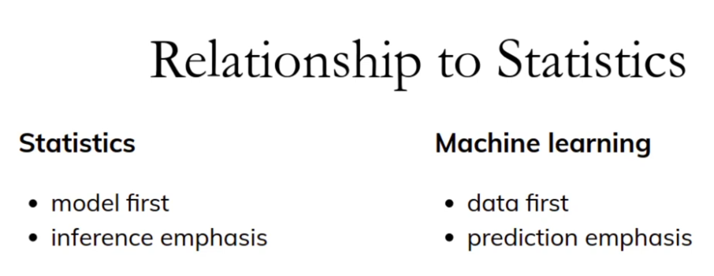

# Applied ML Introduction

## 1. What is machine learning?
> Machine learning is an algorithm where input is a dataset and output is a programme which make predictions.

## Deep learning 
> It can be supervised, unsupervised, or reinforcement learning. It is a subset of machine learning that uses multi-layered neural networks to automatically learn features. 

> It is highly flexible: it acts as supervised for labeled data (classification), unsupervised for finding hidden patterns, and powers reinforcement learning (decision-making agents)

## Applications of Machine Learning
1. Healthcare and Medical Diagnosis
2. Smart Assistants and Human-Machine Interaction
3. Personalized Recommendations and User Experience etc...

## Types of Machine Learning
1. Supervised
2. Unsupervised
3. Reinforcemant

## Supervised Learning

## Unsupervised Learning

## Reinforcemant Learning
> Reward might be very delayed

## Other kinds of learning
1. Semi-supervised
2. Active Learning
3. Forecasting
 --------------------------------

# 1. Supervised Learning

